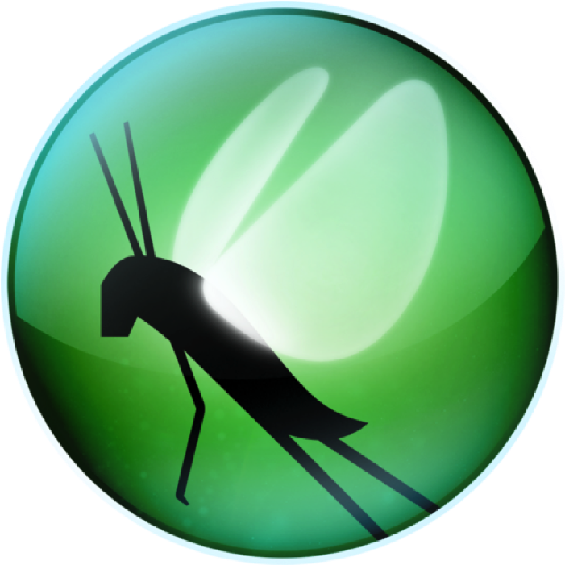

  

### Hey, I'm Ihor Peretiatko

**SDET • Performance Engineer • AI agents • Automation Architect • Release Engineering**

I build AI agents on Claude that do real engineering work: they document tickets,
write and heal Playwright tests, triage CI failures, and assemble release reports.
My other hat is the release train itself: regression gates, deploy verification,
production smoke, notes generated from commit history.

Based in Draper, Utah, a 5 minute walk from Point of the Mountain Flight Park.

---

<h3>Favorite Languages</h3>

  <code></code>
  <code></code>

<h3>Testing & Automation</h3>

  <code></code>
  <code></code>
  <code></code>
  <code></code>
  <code></code>
  <code></code>

<h3>AI Tools</h3>

  <code></code>
  <code></code>
  <code></code>
  <code></code>

<h3>DevOps, CI/CD & Monitoring</h3>

  <code></code>
  <code></code>
  <code></code>
  <code></code>
  <code></code>
  <code></code>
  <code></code>
  <code></code>

<h3>Also Experienced With (Legacy)</h3>

  <code></code>
  <code></code>
  <code></code>
  <code></code>
  <code></code>
  <code></code>

---

### Connect

  <a href="https://linkedin.com/in/ihor-peretiatko" target="_blank" rel="noreferrer">
    <picture>
      <source media="(prefers-color-scheme: dark)" srcset="https://raw.githubusercontent.com/danielcranney/readme-generator/main/public/icons/socials/linkedin-dark.svg" />
      <source media="(prefers-color-scheme: light)" srcset="https://raw.githubusercontent.com/danielcranney/readme-generator/main/public/icons/socials/linkedin.svg" />
      
    </picture>
  </a>
  <a href="https://t.me/p_ihor89" target="_blank" rel="noreferrer">
    <picture>
      <source media="(prefers-color-scheme: dark)" srcset="img/tg_white.svg" />
      <source media="(prefers-color-scheme: light)" srcset="img/tg_black.svg" />
      
    </picture>
  </a>
  <a href="mailto:p_ihor@hotmail.com" target="_blank" rel="noreferrer">
    <picture>
      <source media="(prefers-color-scheme: dark)" srcset="https://cdn.simpleicons.org/minutemailer/white" />
      
    </picture>
  </a>
  <a href="https://github.com/p-igor89" target="_blank" rel="noreferrer">
    <picture>
      <source media="(prefers-color-scheme: dark)" srcset="https://raw.githubusercontent.com/danielcranney/readme-generator/main/public/icons/socials/github-dark.svg" />
      <source media="(prefers-color-scheme: light)" srcset="https://raw.githubusercontent.com/danielcranney/readme-generator/main/public/icons/socials/github.svg" />
      
    </picture>
  </a>

---
### Support Me

