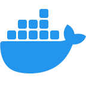

### Hey, I'm Ihor

**SDET • Performance Engineer • Release Manager • Automation Architect**

Building reliable systems and breaking them on purpose. Based in Draper, Utah — 5 min walk from Point of the Mountain Flight Park.

I focus on automation and performance, bringing clarity and confidence to every release. Whether it's hunting bottlenecks, streamlining CI/CD, or making tests smarter with AI — I enjoy challenges that help teams ship faster.

---

### Currently Building

- Test automation powered by AI (smart failure analysis, self-healing tests)
- Automation workflows with n8n and Make (eliminating repetitive tasks)
- Performance testing frameworks that actually scale

### Currently Learning

- AI Agents for test automation
- Kubernetes & cloud-native testing
- Advanced observability patterns

---

<h3>Favorite Languages</h3>

  <code></code>
  <code></code>

<h3>Testing & Automation</h3>

  <code></code>
  <code></code>
  <code></code>
  <code></code>
  <code></code>
  <code></code>

<h3>AI Tools</h3>

  <code></code>
  <code></code>
  <code></code>
  <code></code>
  <code></code>
  <code></code>

<h3>DevOps, CI/CD & Monitoring</h3>

  <code></code>
  <code></code>
  <code></code>
  <code></code>
  <code></code>
  <code></code>
  <code></code>
  <code></code>

<h3>Also Experienced With (Legacy)</h3>

  <code></code>
  <code></code>
  <code></code>
  <code></code>
  <code></code>
  <code></code>
  <code></code>
  <code></code>
  <code></code>

<!-- ═══════════════════════════════════════════════════════════════════════════
     СТАРЫЙ ВАРИАНТ СЕКЦИЙ (закомментирован):

<h3>💻 Core Tech & Automation Skills</h3>

  <code></code>
  <code></code>
  <code></code>
  <code></code>
  <code></code>
  <code></code>
  <code></code>
  <code></code>
  <code></code>
  <code></code>
  <code></code>

<h3>🧰 DevOps, CI/CD & Infrastructure</h3>

  <code></code>
  <code></code>
  <code></code>
  <code></code>
  <code></code>
  <code></code>
  <code></code>
  <code></code>
  <code></code>

<h3>🧩 Project Tools & Utilities</h3>

  <code></code>
  <code></code>
  <code></code>
  <code></code>
  <code></code>
  <code></code>
  <code></code>
  <code></code>
  <code></code>
  <code></code>

     ═══════════════════════════════════════════════════════════════════════════ -->

---

### Featured Projects

**Performance Testing Framework** — Locust-based load testing with Grafana dashboards and real-time metrics

**E2E Automation Suite** — Playwright + TypeScript framework with AI-powered failure analysis

**CI/CD Pipelines** — GitHub Actions workflows for test automation and deployment

**n8n Automation Workflows** — Custom integrations for QA processes and notifications

---

### Connect

  <a href="https://linkedin.com/in/ihor-peretiatko" target="_blank" rel="noreferrer">
    <picture>
      <source media="(prefers-color-scheme: dark)" srcset="https://raw.githubusercontent.com/danielcranney/readme-generator/main/public/icons/socials/linkedin-dark.svg" />
      <source media="(prefers-color-scheme: light)" srcset="https://raw.githubusercontent.com/danielcranney/readme-generator/main/public/icons/socials/linkedin.svg" />
      
    </picture>
  </a>
  <a href="https://t.me/p_ihor89" target="_blank" rel="noreferrer">
    <picture>
      <source media="(prefers-color-scheme: dark)" srcset="img/tg_white.svg" />
      <source media="(prefers-color-scheme: light)" srcset="img/tg_black.svg" />
      
    </picture>
  </a>
  <a href="mailto:p_ihor@hotmail.com" target="_blank" rel="noreferrer">
    <picture>
      <source media="(prefers-color-scheme: dark)" srcset="https://raw.githubusercontent.com/danielcranney/readme-generator/main/public/icons/socials/email-dark.svg" />
      <source media="(prefers-color-scheme: light)" srcset="https://raw.githubusercontent.com/danielcranney/readme-generator/main/public/icons/socials/email.svg" />
      
    </picture>
  </a>
  <a href="https://github.com/p-igor89" target="_blank" rel="noreferrer">
    <picture>
      <source media="(prefers-color-scheme: dark)" srcset="https://raw.githubusercontent.com/danielcranney/readme-generator/main/public/icons/socials/github-dark.svg" />
      <source media="(prefers-color-scheme: light)" srcset="https://raw.githubusercontent.com/danielcranney/readme-generator/main/public/icons/socials/github.svg" />
      
    </picture>
  </a>

---

### Support Me

