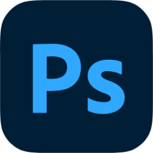

### Hi there 👋 I'm Ihor

- 🤖 Test Automation Engineer
- 📈 Performance Test Engineer
- 🐞 QA Engineer
- 🔭 <a target="_blank" href="cv/cv_aqa_perf_ihor_peretiatko.pdf">My CV is here</a>

My [Linkedin](https://www.linkedin.com/in/ihor-peretiatko/) can tell more about me

I am enthusiastic about test automation and performance testing, and I have a particular affinity for tools
like [Selene](https://github.com/yashaka/selene/), [Locust](https://locust.io/)
and [Playwright](https://playwright.dev/python/)

<!--Stack and tools-->

## 🛠 Languages, Tools, Skills and Expertises

  <code></code>
  <code></code>
  <code></code>
  <code></code>
  <code></code>
  <code></code>
  <code></code>
  <code></code>
  <code></code>
  <code></code>
  <code></code>
  <code></code>
  <code></code>
  <code></code>
  <code></code>
  <code></code>
  <code></code>
  <code></code>
  <code></code>
  <code></code>
  <code></code>
  <code></code>
  <code></code>
  <code></code>
  <code></code>
  <code></code>
  <code></code>
  <code></code>
  <code></code>
  <code></code>
  <code></code>
  <code></code>

<table width="100%" border='0'>
   <tr> 
    <tr>
        <td width="30%" valign="bottom">
            
        </td>
        <td valign="middle">
            School of Test Automation Engineers 
            <a target="_blank" href="https://qa.guru" rel="noopener noreferrer">qa.guru</a>.
        </td>
    </tr>
   </tr>
</table>

### Support Me

<!--
**p-igor89/p-igor89** is a ✨ _special_ ✨ repository because its `README.md` (this file) appears on your GitHub profile.

Here are some ideas to get you started:

- 🔭 I’m currently working on ...
- 🌱 I’m currently learning ...
- 👯 I’m looking to collaborate on ...
- 🤔 I’m looking for help with ...
- 💬 Ask me about ...
- 📫 How to reach me: ...
- 😄 Pronouns: ...
- ⚡ Fun fact: ...
-->
